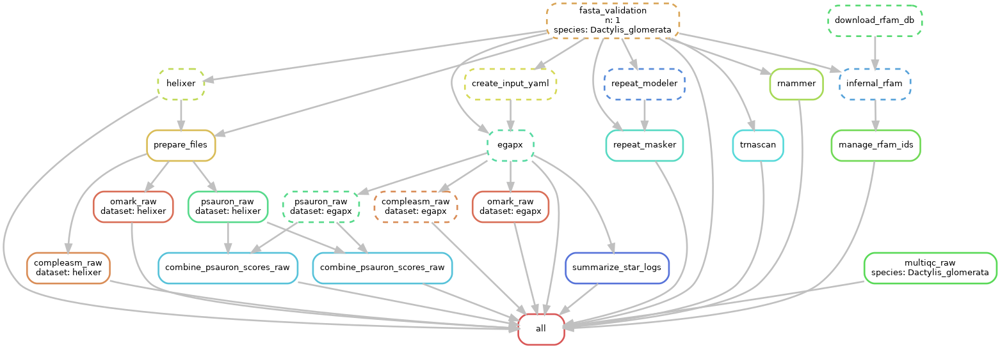

# AnnoCheck: Genome Annotation and Quality Control Pipeline

AnnoCheck is a Snakemake-based workflow designed for comprehensive genome annotation and quality control. The pipeline automates the annotation of coding and non-coding elements, including repeats.
**Soon** will be included a quality check subworflow.
**After** will add combining and filtration steps to produce the final annotation files.

## Example:

DAG of Snakemake rules:


## Installation

- [Snakemake 7.20.0](https://snakemake.readthedocs.io/)
- Slurm workload manager (optimized for the GenoBioInfo cluster at INRAE)

Clone the repository:
```bash
git clone https://github.com/yourusername/AnnoCheck.git
cd AnnoCheck
```

### Required Modules
The following software modules are required and are included in the Snakemake scripts:

- Infernal/1.1.4
- singularity/3.9.9
- Miniconda3
- Helixer/0.3.1
- HelixerPost/4d4799b
- GenomeTools/1.6.5
- fasta_validator/a7cbc40
- EGAPx/0.3.2-alpha
- RepeatModeler/2.0.6
- Python-3.6.3
- RepeatMasker/4.1.8
- tRNAscan-SE/2.0.12
- RNAmmer/1.2
- GenomeTools/1.6.5

## Usage
### 1. Configuration
Modify `workflow/config_path.yaml` to specify input genome files and parameters for annotation.

### 2. Running the Workflow
Run it using:
```bash
cd workflow
sbatch run_snake.sh  # (By default, it runs with --dry-run. Remove the flag after the first check.)
```

### 3. Subworkflows
Stored in workflow/snakepit are subworkflows:
1. launch_annotations.smk
	- protein-coding genes: helixer, egapx
	- repeat masking (RepeatModeler + RepeatMasker)
	- ncRNA - Infernal, RNAmmer, tRNAscan
2. quality_check_raw.smk
	- RNA alignment summary -> MultiQC report
	- Compleasm
	- PSAURON (Annotation assessment tool)
	- OMArk (Genome annotation evaluation)
	- MultiQC (Summarizing QC reports)

## Input Requirements
Specified in workflow/config_path.yaml:
	- **fasta** or **fasta.gz** (tested on haplotype-level de novo assemblies)
	- SRA/fastq/command - public RNA dataset
	- species-related specifications
Included in github repository - `workflow/resources`

## Output
- Annotated genome files and quality control reports will be generated in the `results/` directory.


